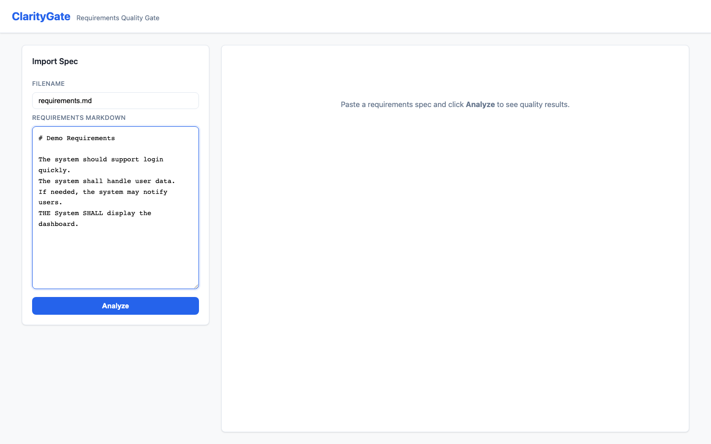
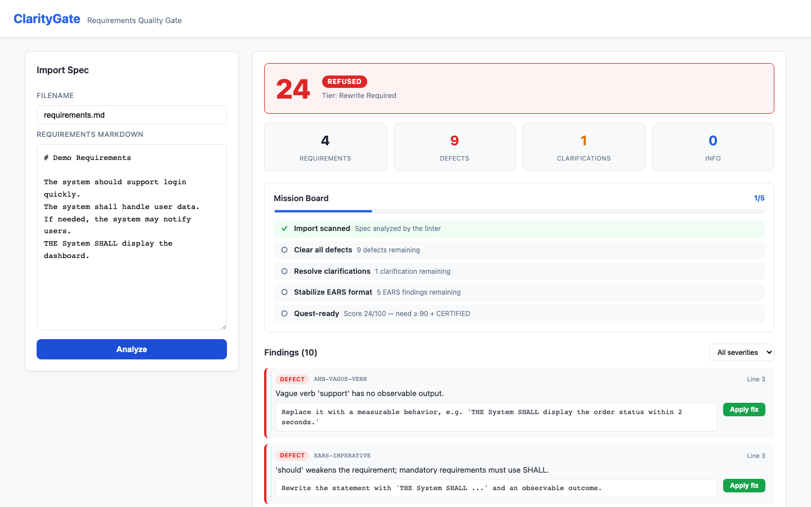
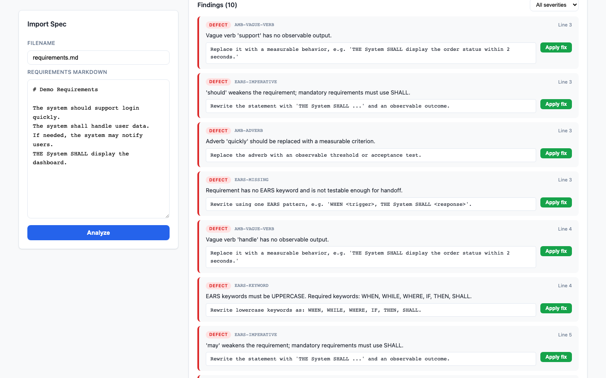
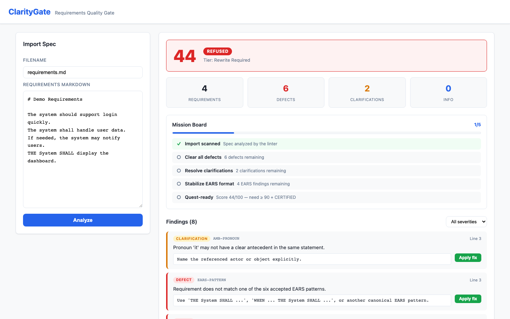
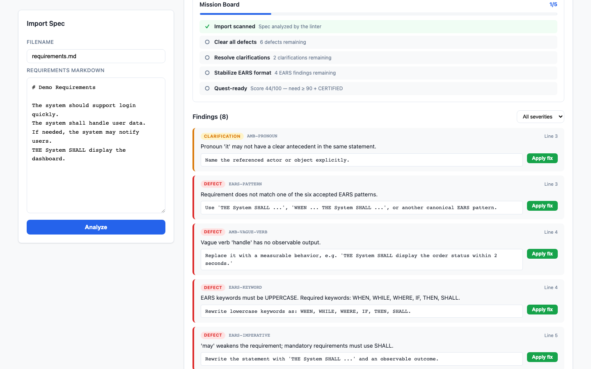
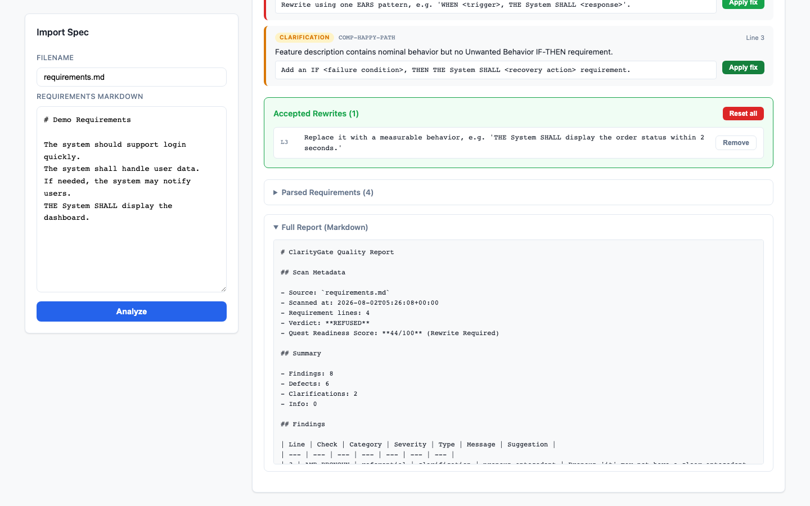

# ClarityGate

A requirements-ambiguity linter for spec-driven development. ClarityGate catches
"requirement bugs" before they propagate to design, code, and tests — practicing
what it preaches by holding its own specs to a strict, testable standard.

## What it does

- **Enforces EARS syntax** — every acceptance criterion must conform to one of the
  six canonical EARS patterns (`WHEN … THE SYSTEM SHALL …`, etc.).
- **Detects linguistic smells** — vague adjectives, unquantified adverbs, passive
  voice, pronoun ambiguity, oblique symbols, and escape clauses.
- **Surfaces tacit knowledge** — flags missing error paths and unstated assumptions
  through abductive reasoning.
- **Produces a Clarification Queue** — two-option questions that turn ambiguity into
  a concrete decision for the spec author.

## Why

In AI-assisted workflows, vague requirements cause **AI drift**: a coding agent fills
the gap with its own inconsistent assumptions. ClarityGate is the quality gateway that
stops drift at the source.

## Current scope

The **frozen core** is a deterministic Python CLI linter — a five-stage pipeline
(loader, parser, rule engine, evaluator, reporter) that scans a `requirements.md`
file and emits a Markdown Quality Report plus a stdout summary.

The `option2-fullstack` branch adds a **local full-stack demo wrapper** around that
frozen core:

- a **FastAPI + SQLite** backend (`backend/`) that exposes the linter over HTTP;
- a **React/Vite** frontend (`frontend/`) for the interactive review loop.

The wrapper only **consumes** the frozen core (`src/linter/`) — it never
reimplements linter logic. The app is strictly **local-only**: no auth, no
Firebase or cloud deployment, and no AI calls.

## How the app works

The full-stack demo runs a tight review loop: paste a draft → analyze → fix
findings → rescore → export. All scoring comes from the frozen deterministic
linter; the UI only renders its output.

**1. Paste a rough spec.** The import panel accepts a Markdown requirements
draft — no special format required.



**2. Analyze — a deterministic verdict.** The linter scans the spec and returns a
Quest Readiness Score and verdict (here **REFUSED 24/100**), per-severity stats,
and a Mission Board showing exactly what remains before the spec is Quest-ready.



**3. Review line-level findings.** Every finding maps to a line, a check ID, and a
severity, with a concrete rewrite suggestion and an **Apply fix** action.



**4. Apply a fix and rescore instantly.** Applying a suggested rewrite reruns the
frozen linter immediately — the score moves (here 24 → 44) and the finding count
drops.



**5. Track progress on the Mission Board.** The board breaks the path to
Quest-ready into missions (clear defects, resolve clarifications, stabilize EARS)
with live remaining counts.



**6. Export the Markdown report.** Accepted rewrites are visible and reversible,
and the full Quality Report (scan metadata, verdict, findings table) is available
as Markdown for handoff.



## Requirements

- **CLI core**: Python 3.11+, standard library only (no `pip install` needed).
- **Backend wrapper**: install `requirements-backend.txt`
  (`pip install -r requirements-backend.txt`).
- **Frontend**: run `npm install` inside `frontend/`.

## Running tests and builds

```bash
python3 -m unittest discover -s tests -v
python3 -m unittest discover -s tests_backend -v
cd frontend && npm run build
```

Or run a single module:

```bash
python3 -m unittest tests.test_rule_engine -v
```

> If your environment provides `python` instead of `python3`, substitute accordingly.

## Running the CLI

```bash
python3 -m linter.claritygate <path-to-requirements.md> [--out <report-path>]
```

Example with a temporary output report:

```bash
python3 -m linter.claritygate data/samples/ambiguous-requirements.md --out /tmp/my-report.md
```

### Exit codes

| Code | Meaning |
|------|---------|
| `0`  | Spec certified — no refusal-level findings |
| `2`  | Spec **REFUSED** — refusal-level findings detected (e.g., lowercase EARS keywords, missing EARS keywords, implementation leakage). This is a linter verdict, not a crash. |

### Demo samples

- `data/samples/ambiguous-requirements.md` — intentionally vague spec (triggers REFUSED)
- `data/samples/clean-ears-requirements.md` — well-formed EARS spec (triggers CERTIFIED)

## Running the full-stack demo

Start the backend (from the repo root):

```bash
python3 -m uvicorn backend.main:create_app --factory --host 127.0.0.1 --port 8000
```

Start the frontend (from `frontend/`):

```bash
npm run dev -- --host 127.0.0.1 --port 5173
```

Then open the local Vite URL (default `http://127.0.0.1:5173`). See
`docs/fullstack-demo-runbook.md` for the full walkthrough.

## Project layout

```
ClarityGate/
├── SKILL.md                 # IDE-agnostic instruction set (Qoder / Kiro / Cursor / Qwen)
├── README.md
├── .gitignore
├── requirements-backend.txt # Backend wrapper dependencies
├── src/linter/              # Frozen core linter implementation
│   ├── models.py            # Shared dataclasses
│   ├── loader.py            # UTF-8 file reader
│   ├── parser.py            # Markdown requirement extractor
│   ├── rule_engine.py       # 15 deterministic checks
│   ├── evaluator.py         # Scoring and verdict
│   ├── reporter.py          # Markdown report writer
│   └── claritygate.py       # CLI orchestration
├── linter/                  # Minimal shim for `python -m linter.claritygate`
├── backend/                 # FastAPI + SQLite wrapper (consumes src/linter)
├── frontend/                # React/Vite demo UI
├── tests/                   # stdlib unittest suite for the core (36 tests)
├── tests_backend/           # Backend wrapper test suite
├── data/samples/            # Demo input files
├── docs/                    # Demo handoff materials
├── specs/
│   └── claritygate-mvp/     # Canonical MVP spec (source of truth)
└── .kiro/specs/claritygate-mvp/   # Kiro mirror of the MVP spec
```

## Getting started

1. Read `SKILL.md` for the enforceable rules.
2. Run the demo: `python3 -m linter.claritygate data/samples/ambiguous-requirements.md --out /tmp/report.md`
3. Open `/tmp/report.md` to see the Clarification Queue and findings table.
4. Author or review specs under `specs/claritygate-mvp/`.
